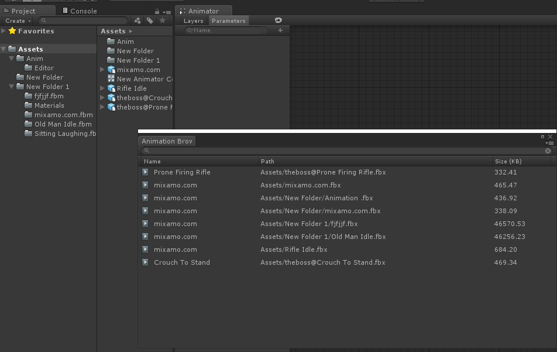
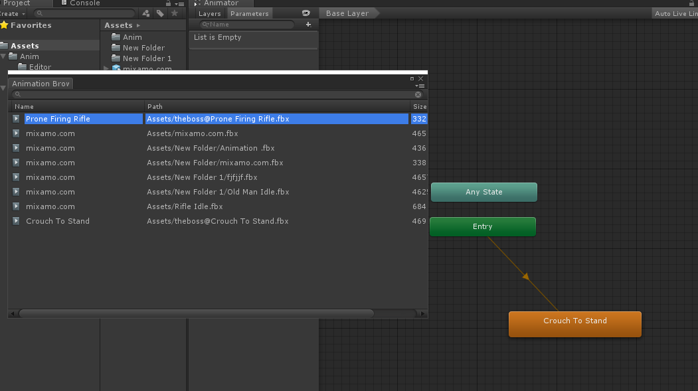
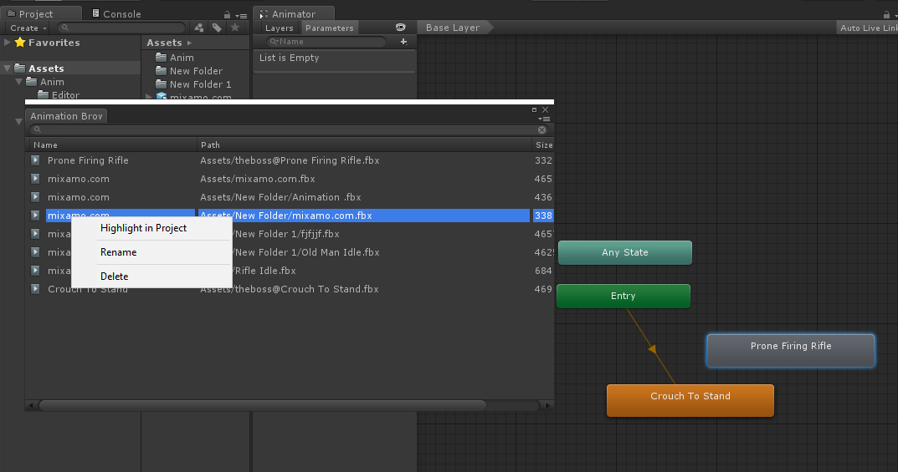

# UnityAnimBrowser

Animation Browser is an extension for Unity Editor that allows easy browsing, renaming, and deleting of animation clips right from the Unity Editor interface.

## Purpose

This plugin was created to streamline the workflow when working with projects containing numerous animation files spread across various folders. It aims to simplify tasks such as adding specific animations to an animator controller or managing animation assets more efficiently.

## Features

- Animation search functionality.
- Sorting animations by name, size, and directory.
With Animation Browser, navigating through animation assets becomes more intuitive, enhancing productivity and organization within Unity projects.

## Installation

Simply add the script files to your Unity project's Assets folder.

## Usage

1. In the Unity Editor, select `Window` > `Animation Browser` to open the animation browsing window.
2. In the animation browsing window, you can search for animation clips by name, preview them, rename them, and delete them.
3. The context menu allows you to perform actions on the animations, such as playback, renaming, and deletion.

## Screenshots

Click to view screenshots

## Known Issues

At the moment, there is an issue with renaming animations where the renaming process affects the file name instead of the animation name. This issue is currently being addressed.
